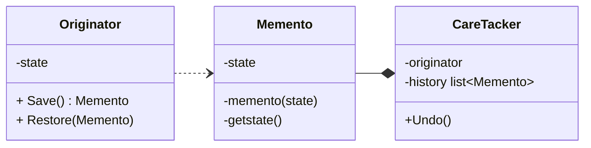

# What is Memento? and When to use it?

# UML Daigram

```mermaid
classDiagram
    direction LR
    Originator ..> Memento 
    Memento --* CareTacker
    Originator :-state
    Originator :+ Save() Memento
    Originator :+ Restore(Memento)
    Memento : -state
    Memento : -memento(state)
    Memento : -getstate()
    CareTacker : -originator
    CareTacker : -history list~Memento~
    CareTacker : +Undo()
```

# :x: Memento pitfalls